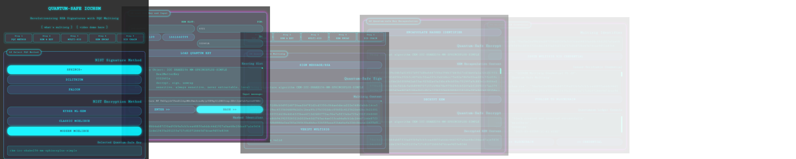

  
  <h2><strong>Pioneering Quantum-Safe Security for Financial Systems</strong></h2> 
  <a href="https://quantumsafe-multisig.web.app">
  
  <a href="https://quantumsafe-multisig.web.app">Visit Quantum-Safe ICCHSM Demo</a>

 

  <h3>Jump to > <a href="api/README.md">Quantum-Safe ICCHSM API Documentation</a></h3> 

  <h1> Quantum-Safe ICCHSM Demo Menu </h1>

## Jump to > [Quantum-Safe ICCHSM API Documentation](api/README.md)

# Quantum-Safe ICCHSM Demonstration

## Introduction

The Quantum-Safe ICCHSM (IronCAP Cryptographic Hardware Security Module) toolkit combines IronCAP™ quantum-safe cryptography with hardware security modules and blockchain technology to secure digital signatures and encrypted data against future quantum computing threats.

This user manual guides you through the demonstration interface for quantum-safe multisig key generation, signature, verification, key encapsulation, and DID credential generation.

## Getting Started

### Accessing the Application

1. Open the ICCHSM demonstration application in your web browser
2. When prompted, enter your PIN code to access the HSM functionality
3. Navigate through the application using the step buttons at the top of the interface

## Step-by-Step Guide

### Step 1: Select PQC Method

In this step, you'll choose the post-quantum cryptography (PQC) algorithms for signature and encryption:

#### Available PQC Methods

| Category | Method | Description |
|----------|--------|-------------|
| **Signature Methods** | Sphincs+ | Stateless hash-based signature scheme (default) |
| | Dilithium | Lattice-based signature scheme |
| | Falcon | Compact lattice-based signature scheme |
| **Encryption Methods** | Modern McEliece | Enhanced version of the code-based encryption (default) |
| | Kyber ML-KEM | Module-lattice based key encapsulation mechanism |
| | Classic McEliece | Code-based encryption |

The selected combination is shown at the bottom of this section as your "Quantum-Safe Key".

### Step 2: Load HSM Key and Input

This step configures the hardware security module and prepares the message to be processed:

1. **HSM Configuration**:
   - Enter your HSM slot number (default: 1209011109) or use the provided shortcut buttons
   - Verify your PIN (demo: 4321) is entered correctly
   - Note the ID field automatically updates based on your selected PQC method from Step 1

2. **Load the Key**:
   - Click "Load Quantum Key" to initialize the HSM with your selected parameters
   - Check the console output to confirm successful key loading

3. **RSA/Message Input**:
   - Enter the RSA/message you want to sign or encrypt in the input field
   - Click "ENTER >>" to save the RSA/message
   - Click "HASH >>" to generate a cryptographic hash of your RSA/message
   - The hash will appear in the "Hashed Identifier" area

### Step 3: Quantum-safe Multisig

This step performs the quantum-safe PQC signature operations:

1. Click "Sign Message/RSA" to create a quantum-safe signature of your RSA/message
2. The PQC signature console will display the operation details
3. The "Multisig Content" area will display the actual PQC signature value
4. Click "Verify Multisig" to validate the PQC signature
5. Check the verification console output to confirm the PQC signature is valid

### Step 4: Quantum-safe Key Encapsulation

This step demonstrates quantum-safe encryption/decryption using Key Encapsulation Mechanism (KEM):

1. Click "Encapsulate Hashed Identifier" to encrypt your RSA/message using the selected encryption method
2. The "Quantum-Safe Encrypt" area will show the operation details
3. The encrypted content will appear in the "KEM Encapsulation Content" area
4. Click "Decrypt KEM" to decrypt the RSA/message
5. The decryption details and decrypted content will be displayed in their respective areas

### Step 5: On-chain DID Credential

This step creates and publishes a Decentralized Identifier (DID) credential to the blockchain ledger:

1. View your "Multisig Identifier" which is automatically generated from the hashed message
2. Click "Issue Multisig DID Credential" to create a verifiable credential
3. Review the credential details in the "Issued Verifiable Credential" area
4. Click "Publish to Blockchain" to record the credential on the Real Matter's Quantumatter Blockchain Ledger
5. The "Quantumeum Ledger Console" will display the transaction results
6. Use the provided buttons to view the blockchain explorer or your credential details

## HSM Slot Options

The demonstration supports two HSM slots:
- 1209011109 (default slot)
- 1661660599 (alternate slot)

Each slot requires its own PIN for access.

## Quantum-Safe Mechanisms

The application supports nine combinations of signature and encryption methods, each with a unique ID:

| ID | Signature Method | Encryption Method |
|----|------------------|-------------------|
| 322601A | Sphincs+ | Modern McEliece |
| 322601B | Sphincs+ | Kyber |
| 322601C | Sphincs+ | Classic McEliece |
| 3226012 | Dilithium | Modern McEliece |
| 3226013 | Dilithium | Kyber |
| 3226014 | Dilithium | Classic McEliece |
| 322600B | Falcon | Modern McEliece |
| 322600C | Falcon | Kyber |
| 3226010 | Falcon | Classic McEliece |

## Troubleshooting

- If you receive an error message, check that your PIN and slot numbers are correct
- Ensure you have completed each step in sequence (hash message before signing, etc.)
- If blockchain ledger publishing fails, check that you have generated a DID credential first

## Technology Partners

This toolkit is a collaboration between:
- **01 Communique Laboratory** - Provider of IronCAP™ Quantum-Safe cryptography
- **Real Matter Technology** - Provider of Chip-Level Blockchain technology

For more information, visit:
- [IronCAP™](https://ironcap.ca)
- [Real Matter Technology](https://www.realmatter.io)
- [Quantumatter Blockchain](https://quantumatter-blockchain.web.app)

  <h2></h2> 
  <h2><strong>Seamless Integration of Quantum-Safe HSM Module & Lattice-Based Chip Entropy for PQC Next-Gen Security</strong></h2>

