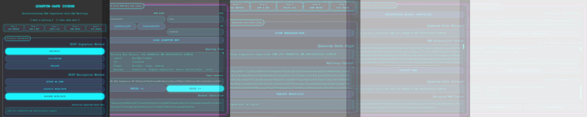

<div align="center">
  
  <h2><strong>Pioneering Quantum-Safe Security for Financial Systems</strong></h2><br>
  <a href="https://quantumsafe-multisig.web.app">
  
  <a href="https://quantumsafe-multisig.web.app">Visit Quantum-Safe ICCHSM Demo</a>
</div>
<br>

<div align="right">
  <h3>Jump to > <a href="../Introduction.md">ICCHSM Introduction</a></h3>
  <h3>Jump to > <a href="../README.md">Quantum-Safe ICCHSM Demo Menu</a></h3><br>
</div>

<div align="center">
  <h1> Quantum-Safe ICCHSM API (Demo Version) Documentation </h1>
</div>

&nbsp;

## Overview
The Quantum-Safe ICCHSM (IronCAP Cryptographic Hardware Security Module) API Demo Version provides endpoints for quantum-safe cryptographic operations including key management, digital signatures, encryption/decryption, and blockchain integration.

&nbsp;

## Base URL
All endpoints are accessible via Firebase Cloud Functions with the base URL:
`https://{function-name}-kez6dpnjlq-uc.a.run.app`

&nbsp;

## PIN Authentication
All endpoints accept POST requests with form-encoded data. No authentication header is required, but operations using the HSM require a valid slot ID and PIN.

&nbsp;

## Service Endpoints

&nbsp;

### 1. HSM Key Management
&nbsp;


#### Show Quantum-Safe Keys from the selected HSM slot
- **Function Name**: `showkey`
- **URL**: `https://showkey-kez6dpnjlq-uc.a.run.app`
- **Method**: `POST`
- **Parameters**:
  - `slot` (string, required): HSM slot ID (e.g., "1209011109" or "1661660599")
  - `pin` (string, required): PIN for the HSM slot
- **curl Example**:
  ```bash
  curl -X POST https://showkey-kez6dpnjlq-uc.a.run.app \
       -H "Content-Type: application/x-www-form-urlencoded" \
       -d "slot=1209011109" \
       -d "pin=4321"
  ```
- **Response**:
  ```json
  {
    "console_log":"Key object information output"
  }
  ```  

&nbsp;

#### Read the public key of the selected quantum-safe key pair
- **LOCKED FUNCTION FOR SUBSCRIBED USERS ONLY**:
- **Function Name**: `publickey`
- **URL**: `https://publickey-kez6dpnjlq-uc.a.run.app`
- **Method**: `GET`
- **Parameters**:
  - `slot` (string, required): HSM slot ID (e.g., "1209011109" or "1661660599")
  - `pin` (string, required): PIN for the HSM slot
- **curl Example**:
  ```bash
  curl -X POST https://publickey-kez6dpnjlq-uc.a.run.app \
       -H "Content-Type: application/x-www-form-urlencoded" \
       -d "slot=1209011109" \
       -d "pin=4321"
  ```
- **Response**:
  ```json
  {
    "console_log":"Public_key_value_in_DER_format"
  }
  ```  

&nbsp;
 
### 2. RSA/Message Input

&nbsp;

#### Enter the RSA/message to be signed or encrypted by the quantum-safe ICCHSM
- **Function Name**: `writemessage`
- **URL**: `https://writemessage-kez6dpnjlq-uc.a.run.app`
- **Method**: `POST`
- **Parameters**:
  - `message` (string, required): The message to store for signing or encryption
- **curl Example**:
  ```bash
  curl -X POST https://writemessage-kez6dpnjlq-uc.a.run.app \
       -H "Content-Type: application/x-www-form-urlencoded" \
       -d "message=This is a test RSA/message to be signed or encrypted"
  ```
- **Response**:
  ```json
  {
    "status":"Message saved successfully"
  }
  ```

&nbsp;

#### Generate a cryptographic hash of the RSA message as a DID identifier
- **Function Name**: `hashmessage`
- **URL**: `https://hashmessage-kez6dpnjlq-uc.a.run.app`
- **Method**: `POST`
- **Parameters**: None (uses previously stored message)
- **curl Example**:
  ```bash
  curl -X POST https://hashmessage-kez6dpnjlq-uc.a.run.app
  ```
- **Response**:
  ```json
  {
    "binary_content":"hash_value_string",
    "status":"Message hashed successfully"
  }
  ```

&nbsp;

### 3. Quantum-Safe Signature Operations

&nbsp;

#### Create a quantum-safe signature of the RSA/message using the selected mechanism
- **Function Name**: `signmessage`
- **URL**: `https://signmessage-kez6dpnjlq-uc.a.run.app`
- **Method**: `POST`
- **Parameters**:
  - `slot` (string, required): HSM slot ID
  - `pin` (string, required): PIN for the HSM slot
  - `id` (string, required): Key ID (e.g., "322601A")
  - `mechanism` (string, required): Selected quantum-safe mechanism (e.g., "ckm-icc-shake256-mm-sphincsplus-simple")
- **curl Example**:
  ```bash
  curl -X POST https://signmessage-kez6dpnjlq-uc.a.run.app \
       -H "Content-Type: application/x-www-form-urlencoded" \
       -d "slot=1209011109" \
       -d "pin=4321" \
       -d "id=322601A&mechanism=ckm-icc-shake256-mm-sphincsplus-simple"
  ```
- **Response**:
  ```json
  {
    "console_log":"Using signature algorithm CKM-ICC-SHAKE256-MM-SPHINCSPLUS-SIMPLE",
    "operation":"Sign"
  }
  ```

&nbsp;

#### Display the PQC signature value of the Multi-sig content 
- **Function Name**: `readsignature`
- **URL**: `https://readsignature-kez6dpnjlq-uc.a.run.app`
- **Method**: `GET`
- **Parameters**: None
- **curl Example**:
  ```bash
  curl -X GET https://readsignature-kez6dpnjlq-uc.a.run.app
  ```
- **Response**:
  ```json
  {
    "content":"signature_value"
  }
  ```

&nbsp;

#### Verify Multisig to validate the PQC signature
- **Function Name**: `verifysignature`
- **URL**: `https://verifysignature-kez6dpnjlq-uc.a.run.app`
- **Method**: `POST`
- **Parameters**:
  - `slot` (string, required): HSM slot ID
  - `pin` (string, required): PIN for the HSM slot
  - `id` (string, required): Key ID
  - `mechanism` (string, required): Selected quantum-safe mechanism
- **curl Example**:
  ```bash
  curl -X POST https://verifysignature-kez6dpnjlq-uc.a.run.app \
       -H "Content-Type: application/x-www-form-urlencoded" \
       -d "slot=1209011109" \
       -d "pin=4321" \
       -d "id=322601A&mechanism=ckm-icc-shake256-mm-sphincsplus-simple"
  ```
- **Response**:
  ```json
  {
    "console_log":"Signature is valid",
    "operation":"Verify"
  }
  ```

&nbsp;

### 4. Quantum-safe Key Encapsulation Operations

&nbsp;

#### Create a quantum-safe encryption of the RSA/message using the selected mechanism
- **Function Name**: `encryptmessage`
- **URL**: `https://encryptmessage-kez6dpnjlq-uc.a.run.app`
- **Method**: `POST`
- **Parameters**:
  - `slot` (string, required): HSM slot ID
  - `pin` (string, required): PIN for the HSM slot
  - `id` (string, required): Key ID
  - `mechanism` (string, required): Selected quantum-safe mechanism
- **curl Example**:
  ```bash
  curl -X POST https://encryptmessage-kez6dpnjlq-uc.a.run.app \
       -H "Content-Type: application/x-www-form-urlencoded" \
       -d "slot=1209011109" \
       -d "pin=4321" \
       -d "id=322601A" \
       -d "mechanism=ckm-icc-shake256-mm-sphincsplus-simple"
  ```
- **Response**:
  ```json
  {
    "console_log":"Using encrypt algorithm CKM-ICC-SHAKE256-MM-SPHINCSPLUS-SIMPLE",
    "operation":"Encrypt"
  }
  ```

&nbsp;

#### Read an encrypted message for the KEM encapsulation content
- **Function Name**: `readencrypted`
- **URL**: `https://readencrypted-kez6dpnjlq-uc.a.run.app`
- **Method**: `GET`
- **Parameters**: None
- **curl Example**:
  ```bash
  curl -X GET https://readencrypted-kez6dpnjlq-uc.a.run.app
  ```
- **Response**:
  ```json
  {
    "content": "KEM_encapsulation_content"
  }
  ```

&nbsp;

#### Decrypt the encrypted message for the KEM encapsulation content
- **Function Name**: `decryptmessage`
- **URL**: `https://decryptmessage-kez6dpnjlq-uc.a.run.app`
- **Method**: `POST`
- **Parameters**:
  - `slot` (string, required): HSM slot ID
  - `pin` (string, required): PIN for the HSM slot
  - `id` (string, required): Key ID
  - `mechanism` (string, required): Selected quantum-safe mechanism
- **curl Example**:
  ```bash
  curl -X POST https://decryptmessage-kez6dpnjlq-uc.a.run.app \
       -H "Content-Type: application/x-www-form-urlencoded" \
       -d "slot=1209011109" \
       -d "pin=4321" \
       -d "id=322601A" \
       -d "mechanism=ckm-icc-shake256-mm-sphincsplus-simple"
  ```
- **Response**:
  ```json
  {
    "console_log":"Using decrypt algorithm CKM-ICC-SHAKE256-MM-SPHINCSPLUS-SIMPLE",
    "operation":"Decrypt"
  }
  ```

&nbsp;

#### Read the decrypted KEM encapsulation content from the encrypted message
- **Function Name**: `readdecrypted`
- **URL**: `https://readdecrypted-kez6dpnjlq-uc.a.run.app`
- **Method**: `GET`
- **Parameters**: None
- **curl Example**:
  ```bash
  curl -X GET https://readdecrypted-kez6dpnjlq-uc.a.run.app
  ```
- **Response**:
  ```json
  {
    "content": "decrypted_content"
  }
  ```

&nbsp;

## Error Responses
All endpoints may return the following error responses:

- **Status 405**: Method Not Allowed (if incorrect HTTP method is used)
- **Status 504**: Gateway Timeout (if target server doesn't respond)
- **Status 500**: Internal Server Error (for general errors)

Error response format:
```json
{
  "error": "Error type",
  "details": "Error details"
}
```

&nbsp;

## Technology Partners

This toolkit is a collaboration between:
- **01 Communique Laboratory** - Provider of IronCAP™ Quantum-Safe cryptography
- **Real Matter Technology** - Provider of Chip-Level Blockchain technology

For more information, visit:
- [IronCAP™](https://ironcap.ca)
- [Real Matter Technology](https://www.realmatter.io)
- [Quantumatter Blockchain](https://quantumatter-blockchain.web.app)

<div align="center">
  <h2></h2><br>
  <h2><i>Seamless Integration of Quantum-Safe HSM Module & Lattice-Based Chip Entropy for PQC Next-Gen Security</i><br><br></h2>
</div>
